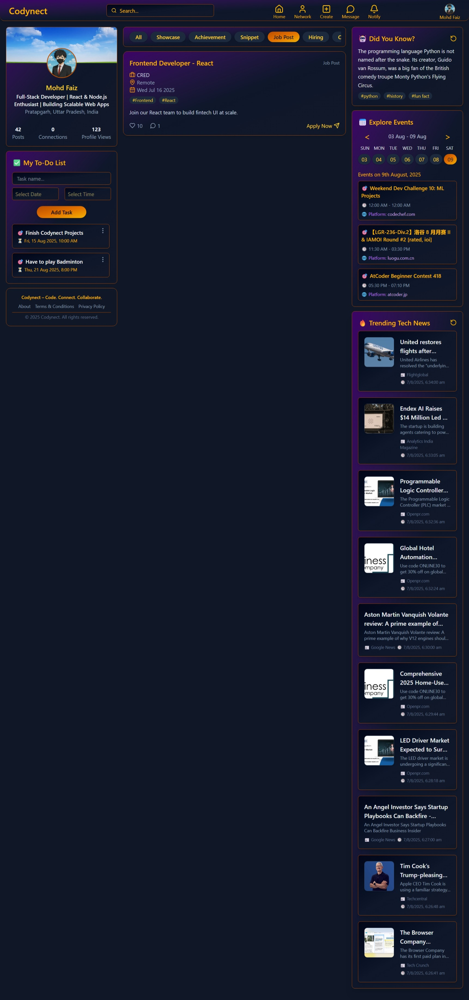
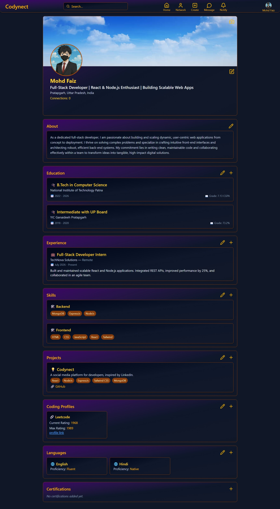
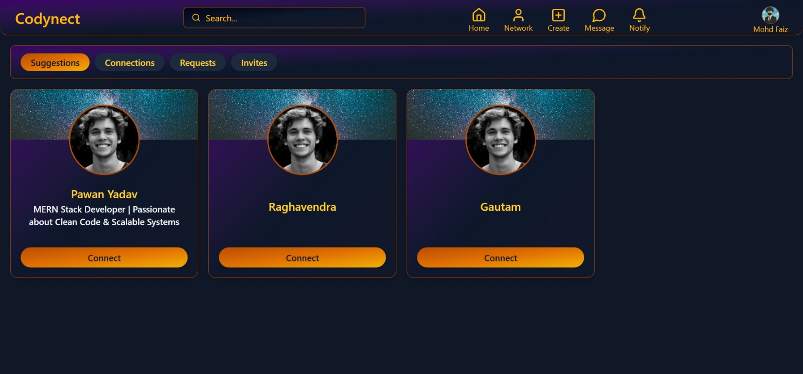

# Codynect

**Codynect** is an ongoing project to build a comprehensive social media platform tailored specifically for developers. It aims to provide a centralized space where developers can connect, collaborate, share knowledge, and stay updated on the latest tech trends and events.

---

## 🔑 Current Features

- **👤 User Authentication & Profile Management**  
  Secure login and registration system. Users can create and manage detailed profiles with sections for:

  - 🎓 Education
  - 💼 Experience
  - 🛠️ Projects
  - 🧠 Skills
  - 📜 Certifications
  - 💻 Programming Languages  
    All updates reflect in real-time with full backend integration.

- **🌐 Social Networking & Connection System**  
  A complete connection management module that allows users to:

  - ➕ Send connection requests
  - ✅ Accept or ❌ Reject requests
  - 🔄 Withdraw sent requests
  - 🔗 Disconnect existing connections  
    Enables building a strong and relevant developer network.

- **📰 Dynamic Content Feed**  
  Integrated external APIs to enhance user engagement:

  - 🧩 **Tech Facts** from the Gemini API
  - 📅 **Explore Events**: Upcoming developer-focused tech events
  - 📈 **Trending News**: Latest updates from the tech industry

- **✅ Personal Productivity Tool**  
  A built-in **To-Do List** on the main dashboard helps users track and manage personal tasks effectively.

- **🧠 Enhanced About Section**  
  AI-powered suggestions for improving the “About Me” section, along with confirmation modals for a smoother editing experience.

---

## 💻 Tech Stack

### 🌐 Frontend

- **React.js** – Component-based UI
- **Redux Toolkit** – State management
- **Tailwind CSS** – Utility-first styling
- **Axios** – HTTP client for API communication

### 🖥️ Backend

- **Node.js** – Server-side JavaScript
- **Express.js** – Backend framework
- **MongoDB** – NoSQL database
- **Mongoose** – ODM for MongoDB
- **JWT** – Authentication
- **Bcrypt.js** – Password hashing

### 🔗 External Integrations

- **Gemini API (Google AI Studio)** – Generating daily tech facts
- **Clist.by API** – Displaying upcoming tech events
- **Newsdata.io API** – Fetching trending tech news

---

## 📸 Screenshots

### 🏠 Home Page

### 👤 Profile Page

### 🔗 Network Page

---
